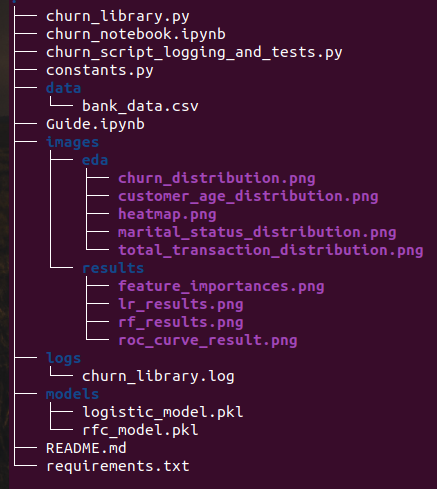

# Churn

## Description

This project focuses on predicting customer churn using machine learning models. It produces insights through comprehensive exploratory data analysis (EDA). The workflow includes training and evaluating two distinct models to generate accurate churn predictions, providing a solution for customer retention strategies.

## Table of Contents

- Installation
- Files and Data Description
- Usage
- Testing
- Features

## Installation

Clone the repository and install dependencies: 

bash 

`git clone https://github.com/RodolfoPCruz/churn_project_udacity.git`

`cd  churn_project_udacity` 

`pip install -r requirements.txt`

## Files and Data Description

### Project Structure

The project is organized as follows:




- "churn_library.py": script to load the dataset, perform exploratory data analysis, feature engineering,  modeling, and model evaluation;
- "churn_notebook.ipynb": A Jupyter Notebook that serves the same purpose as `churn_library.py`, providing an interactive environment for data analysis, feature engineering, and model training;
- "churn_script_logging_and_tests.py": Unit tests designed to ensure that `churn_library.py` functions correctly and logs are generated as expected;
- "constants.py": File containing constant values used across the project ;
- The images in the directory "./images/eda" are plots created during exploratory data analysis;
- "feature_importances.png" is a plot showing the feature importances of the random forest model;
- "lr_results.png": classification report of the Logistic Regression model;
- "rf_results.png": classification report of the Random Forest model;
- "roc_curve_result.png: roc" curves of the model in a same plot;
- "churn_library.log": logs created during tests;
- the "models" directory contains the saved models;
- "requirements.txt" : dependencies required for the project ;
- "README.md" : project documentation.

### Project Structure

####  [bank_data.csv](data/bank_data.csv) 

- Contains the data used for training the machine learning models.

  ```
     | Column Name   | Description                                  |
     |---------------|----------------------------------------------|
     | Unnamed: 0   | Unique identifier for each customer         |
     | CLIENTNUM    |                          |
     | Attrition_Flag | Target variable: Attrited Customer if customer churned, Existing Customer otherwise |	 	
     | Customer_Age	 | Age of the customer |
     | Gender| Gender of the customer |
     | Dependent_count| Number of dependents  |
     | Education_Level| Education level of the cuastomer |
     | Marital_Status| Marital Status of the customer |
     | Income_Category| Income category of the customer (6 categories)|
     | Card_Category| Card Category of the customer (4 categories)|
     | Months_on_book||
     | Total_Relationship_Count||
     | Months_Inactive_12_mon||
     | Contacts_Count_12_mon||
     | Credit_Limit| Credit limit of the customer|
     | Total_Revolving_Bal||
     | Avg_Open_To_Buy||
     | Total_Amt_Chng_Q4_Q1||
     | Total_Trans_Amt||
     | Total_Trans_Ct||
     | Total_Ct_Chng_Q4_Q1||
     |Avg_Utilization_Ratio||
  ```
  
  

## Usage

To run the entire machine learning workflow, starting from dataset loading to model evaluation, execute the following command:

bash

`python churn_library.py` 

To perform only the exploratory data analysis, run the following command:

bash

`python -c "from churn_library import perform_eda,  import_data, FILE_PATH; perform_eda(import_data(FILE_PATH))"`

## Testing

The project includes unit tests to ensure the correctness and reliability of the module. These tests validate the core functionality of `churn_library.py`, including:

- import_data
- perform_eda
- encoder_helper
- perform_feature_engineering
- train_models

### Framework

The tests are implemented using the `pytest` framework, which is listed as a dependency in `requirements.txt`.

### Running Tests

To run all the test execute the following command:

bash

`python churn_script_logging_and_tests.py` 

To test only one function, execute one of the following commands according to the function to be tested:

For function import_data, run:

bash

`pytest churn_script_logging_and_tests.py::test_import`

For function perform_eda, run:

`pytest churn_script_logging_and_tests.py::test_eda`

For function encoder_helper, run:

`pytest churn_script_logging_and_tests.py::test_encoder_helper`

For function perform_feature_engineering, run:

`pytest churn_script_logging_and_tests.py::test_perform_feature_engineering`

For function train_models, run:

`pytest churn_script_logging_and_tests.py::test_train_models`

## Features

- Exploratory data analysis (EDA)

  It performs EDA and saves the plots of univariate analysis and bivariate analysis.

- Feature engineering

- Modeling

- Model Evaluation

  It saves a classification report for each model and the ROC curves.

- Feature Importance


